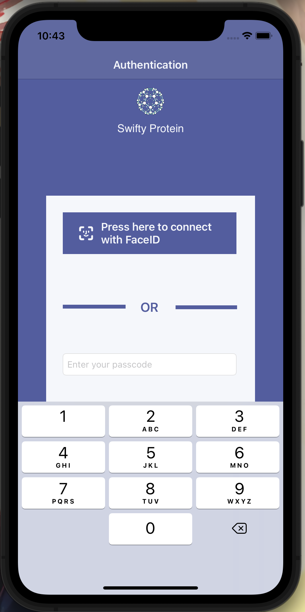

# 🧬 Swifty Protein

## 📱 Description  
**Swifty Protein** est une application mobile développée pour explorer la modélisation 3D de ligands biologiques.  
Ce projet m’a permis de découvrir les bases du rendu 3D sur mobile, tout en intégrant des fonctionnalités modernes comme la biométrie, la recherche et le partage social.

🔍 Objectifs du projet :
- Visualiser des molécules en 3D avec SceneKit  
- Implémenter l’authentification biométrique (TouchID, FaceID)  
- Intégrer une barre de recherche pour filtrer les ligands  
- Ajouter des options de partage via les API sociales  
- Acquérir une compréhension de base en biochimie

---

## 🛠️ Stack technique

- **Swift 5** – langage principal  
- **SceneKit** – rendu 3D  
- **Alamofire 5.4.3** – gestion des requêtes réseau  
- **Swift Keychain Wrapper 4.0.1** – sécurisation des données utilisateur

---

## 📸 Aperçu de l’application

  
  
  

---

## 🚀 Ce que j’ai appris

- Intégrer des composants 3D dans une app mobile  
- Utiliser des API natives comme TouchID et FaceID  
- Gérer la navigation et les interactions utilisateur  
- Travailler avec des données biologiques et les représenter visuellement

